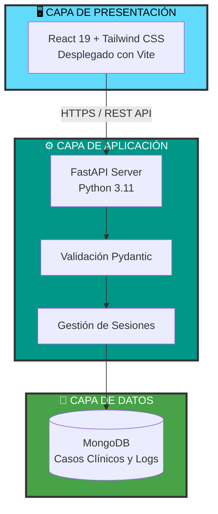
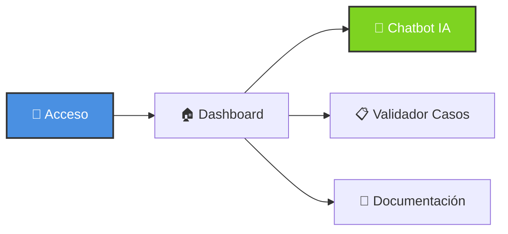

<div align="center">

# 🏥 App Chatbot Hospital de Talavera

### Asistente Inteligente y Validador de Casos Clínicos

[](https://github.com/Alejandro14-hue/PIMD-CodeCrusaiders)
[](https://github.com/Alejandro14-hue/PIMD-CodeCrusaiders)


---

</div>

## 🎯 ¿Qué es este Proyecto?

Esta aplicación es una solución intermodular diseñada para modernizar la asistencia sanitaria en el **Hospital de Talavera de la Reina**. 

Permite a los profesionales médicos acceder a un **asistente de IA especializado**, visualizar registros y validar casos clínicos de forma dinámica, integrando el trabajo de estudiantes de **DAM, DAW y el curso de Especialización en IA**.

### ✨ Características Principales

- 🤖 **Chatbot IA Especializado**: Entrenado para responder consultas según protocolos locales.
- 📋 **Gestión de Casos Clínicos**: Validar historiales y datos médicos de forma eficiente.
- 🔐 **Arquitectura Segura**: Comunicación cifrada entre React y FastAPI.
- 📱 **Diseño Responsivo**: Totalmente funcional en dispositivos móviles y escritorio.

---

## 🏗️ Arquitectura del Sistema

Hemos implementado una arquitectura moderna desacoplada para garantizar velocidad y escalabilidad.



---

## 🎨 Flujo de la Aplicación

### Interfaz (Frontend)

El flujo de usuario está optimizado para la rapidez que requiere un entorno hospitalario:



---

## ⚡ Instalación y Configuración

### 1️⃣ Requisitos Previos
- **Python 3.11+**
- **Node.js 18+**
- **MongoDB** corriendo en local o vía Docker

### 2️⃣ Backend (FastAPI)
```bash
cd backend-fastapi
python -m venv venv
.\venv\Scripts\activate  # Windows
pip install -r requirements.txt
uvicorn main:app --reload
```

### 3️⃣ Frontend (React + Vite)
```bash
cd front_proyecto
npm install
npm run dev
```

---

## 🐳 Despliegue con Docker

Para una configuración rápida "un solo click":

```bash
# Levantar el ecosistema completo
docker compose up -d

# Detener servicios
docker compose down
```

---

## 🛠️ Stack Tecnológico

### Frontend
- **React 19**: Interfaz declarativa y reactiva.
- **Vite**: Bundler de última generación.
- **Tailwind CSS**: Estilizado basado en utilidades.

### Backend
- **FastAPI**: Rendimiento similar a Go/Node gracias a Python asíncrono.
- **Motor**: Acceso asíncrono a MongoDB.
- **Pydantic**: Seguridad de tipos y esquemas.

### Almacenamiento
- **MongoDB**: Flexibilidad total para datos médicos complejos.

---

## 👥 Equipo y Colaboración

<div align="center">

| Curso | Integrantes |
|:--- |:--- |
| **2º DAM** | **Alvaro Rodrigo Cantalejo** *(Líder DAM)*<br>Adrián Sánchez Elvira<br>Alejandro Galán Martín<br>Omar Barrero Calderón |
| **2º DAW** | **Diego Gonzalez Toledano** *(Líder DAW)*<br>Claudia Rodriguez<br>Hugo Rubio |

</div>

---

<div align="center">

## � Recursos

[](./docs)
[](https://iesriberadeltajo.es)

**Chatbot Talavera** - *Proyecto Educativo 2025-2026*

</div>
