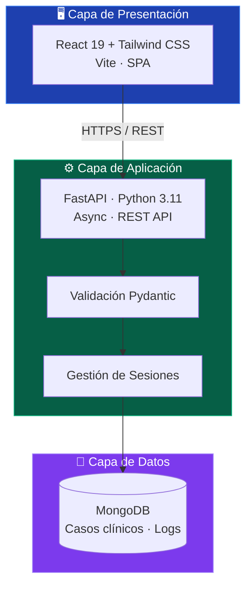
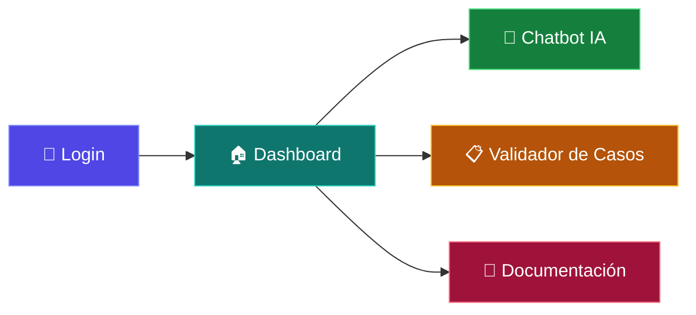

<div align="center">

<br/>


# Chatbot Hospital de Talavera

**Asistente Inteligente y Validador de Casos Clínicos**

*Proyecto educativo intermodular · IES Ribera del Tajo · Curso 2025–2026*

<br/>


<br/>

[](https://react.dev)
[](https://vite.dev)
[](https://fastapi.tiangolo.com)
[](https://python.org)
[](https://mongodb.com)
[](https://docker.com)

<br/>

[Documentación](#-documentación) · [Instalación](#-instalación-y-configuración) · [Arquitectura](#-arquitectura-del-sistema) · [Equipo](#-equipo)

<br/>

---

</div>

## ¿Qué es este proyecto?

El **Chatbot Hospital de Talavera** es una solución intermodular diseñada para modernizar la asistencia sanitaria en el Hospital de Talavera de la Reina. Permite a los profesionales médicos acceder a un **asistente de IA especializado**, visualizar registros y validar casos clínicos de forma dinámica.

El proyecto integra el trabajo colaborativo de estudiantes de **2º DAM**, **2º DAW** y el **Curso de Especialización en IA**, siendo un ejemplo real de desarrollo de software en entorno educativo multidisciplinar.

<br/>

## Características principales

| Funcionalidad | Descripción |
|---|---|
| 🤖 **Chatbot IA** | Asistente entrenado para responder según protocolos locales del hospital |
| 📋 **Validador de casos** | Revisión y validación eficiente de historiales y datos médicos |
| 🔐 **Arquitectura segura** | Comunicación cifrada entre frontend React y backend FastAPI |
| 📱 **Diseño responsivo** | Interfaz optimizada para móvil, tablet y escritorio |

<br/>

## Arquitectura del sistema

La aplicación sigue una arquitectura desacoplada de tres capas para garantizar velocidad, escalabilidad y mantenibilidad.


```mermaid
graph TB
    subgraph Frontend["🖥️  Capa de Presentación"]
        UI["React 19 + Tailwind CSS
        Vite · SPA"]
    end

    subgraph Backend["⚙️  Capa de Aplicación"]
        FastAPI["FastAPI · Python 3.11
        Async · REST API"]
        Pydantic["Validación Pydantic"]
        Auth["Gestión de Sesiones"]
    end

    subgraph Data["💾  Capa de Datos"]
        MongoDB[("MongoDB
        Casos clínicos · Logs")]
    end

    UI -- "HTTPS / REST" --> FastAPI
    FastAPI --> Pydantic --> Auth --> MongoDB

    style Frontend  fill:#1e40af,stroke:#3b82f6,color:#fff
    style Backend   fill:#065f46,stroke:#10b981,color:#fff
    style Data      fill:#7c3aed,stroke:#a78bfa,color:#fff
```

<br/>

## Flujo de la aplicación


```mermaid
flowchart LR
    A["🔑 Login"] --> B["🏠 Dashboard"]
    B --> C["💬 Chatbot IA"]
    B --> D["📋 Validador de Casos"]
    B --> E["📑 Documentación"]

    style A fill:#4f46e5,stroke:#818cf8,color:#fff
    style B fill:#0f766e,stroke:#2dd4bf,color:#fff
    style C fill:#15803d,stroke:#4ade80,color:#fff
    style D fill:#b45309,stroke:#fbbf24,color:#fff
    style E fill:#9f1239,stroke:#fb7185,color:#fff
```

<br/>

## Stack tecnológico

### Frontend
- **React 19** — Interfaz declarativa y reactiva con componentes modernos
- **Vite 7** — Bundler de última generación con HMR ultrarrápido
- **Tailwind CSS** — Sistema de estilos basado en utilidades

### Backend
- **FastAPI** — Servidor asíncrono de alto rendimiento (Python 3.11)
- **Pydantic** — Validación de datos y seguridad de tipos
- **Motor** — Cliente asíncrono para MongoDB

### Datos e infraestructura
- **MongoDB** — Base de datos documental flexible para datos médicos
- **Docker + Docker Compose** — Contenedorización y orquestación del ecosistema

<br/>

## Instalación y configuración

### Requisitos previos

Asegúrate de tener instalado lo siguiente antes de comenzar:

- **Python 3.11+**
- **Node.js 18+**
- **MongoDB** corriendo en local o vía Docker

---

### Opción A — Ejecución manual

#### 1. Backend (FastAPI)

```bash
cd backend-fastapi
python -m venv venv

# Activar entorno virtual
source venv/bin/activate       # macOS / Linux
.\venv\Scripts\activate        # Windows

pip install -r requirements.txt
uvicorn main:app --reload
```

> El servidor arrancará en `http://localhost:8000`  
> Documentación interactiva disponible en `http://localhost:8000/docs`

#### 2. Frontend (React + Vite)

```bash
cd front_proyecto
npm install
npm run dev
```

> La app estará disponible en `http://localhost:5173`

---

### Opción B — Docker (recomendado)

Levanta todo el ecosistema con un solo comando:

```bash
# Iniciar todos los servicios
docker compose up -d

# Ver logs en tiempo real
docker compose logs -f

# Detener servicios
docker compose down
```

<br/>

## Estructura del proyecto

```
📦 chatbot-hospital-talavera
├── 🗂️  backend-fastapi/
│   ├── main.py               # Punto de entrada FastAPI
│   ├── routers/              # Endpoints organizados por dominio
│   ├── models/               # Esquemas Pydantic
│   └── requirements.txt
├── 🗂️  front_proyecto/
│   ├── src/
│   │   ├── components/       # Componentes React reutilizables
│   │   ├── pages/            # Vistas principales
│   │   └── main.jsx
│   └── package.json
├── 🐳  docker-compose.yml
└── 📄  README.md
```

<br/>

## Equipo

<div align="center">

### 2º Desarrollo de Aplicaciones Multiplataforma (DAM)

| Rol | Nombre |
|---|---|
| 👑 **Líder DAM** | Álvaro Rodrigo |
| Desarrollador | Adrián Sánchez |
| Desarrollador | Alejandro Galán |
| Desarrollador | Omar Barrero |

### 2º Desarrollo de Aplicaciones Web (DAW)

| Rol | Nombre |
|---|---|
| 👑 **Líder DAW** | Diego González |
| Desarrolladora | Claudia Rodríguez |
| Desarrollador | Hugo Rubio |

</div>

<br/>

## Documentación

| Recurso | Enlace |
|---|---|
| 📄 Actas de conciliación | [Google Docs](https://docs.google.com/document/d/1bBpsNPGa1qf3z5jqF7VlgnffzNveZo2EUUL07oe-dw0/edit?usp=sharing) |
| 🏫 IES Ribera del Tajo | [iesriberadeltajo.es](https://riberadeltajo.es) |
| 📚 Docs FastAPI | [fastapi.tiangolo.com](https://fastapi.tiangolo.com) |
| 📚 Docs MongoDB | [mongodb.com/docs](https://mongodb.com/docs) |
| 📚 Docs React | [react.dev](https://react.dev) |

<br/>

---

<div align="center">

Proyecto educativo desarrollado en el **IES Ribera del Tajo** · Talavera de la Reina

*DAM · DAW · Especialización en IA · 2025–2026*

</div>

